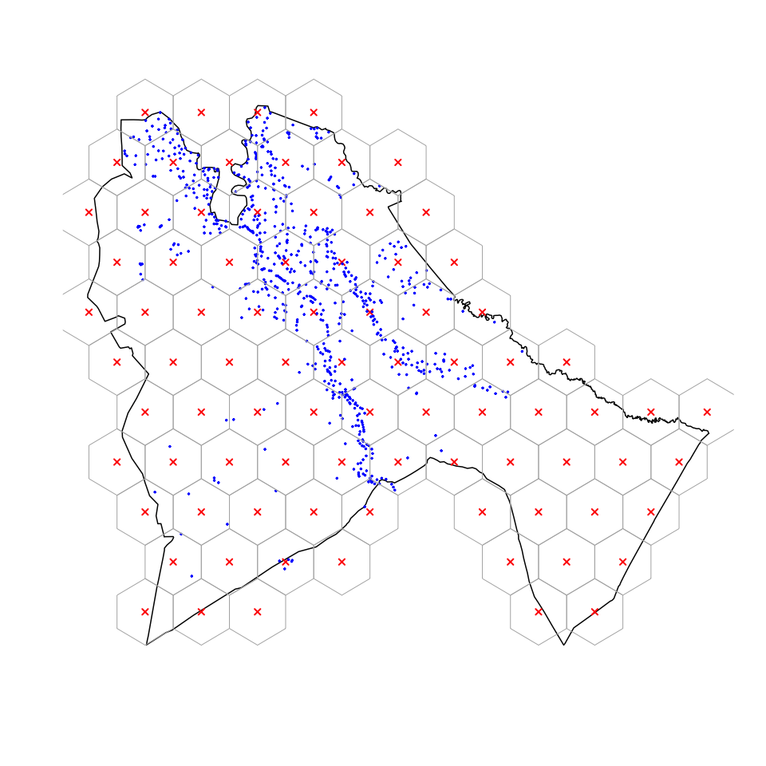

<!-- README.md is generated from README.Rmd. Please edit that file -->

# spatialsampler: An Implementation of Centric Systematic Area Sampling (CSAS) and Simple Spatial Sampling Method (S3M) in R

[](https://travis-ci.org/validmeasures/spatialsampler)
[](https://ci.appveyor.com/project/validmeasures/spatialsampler)
[](https://codecov.io/gh/validmeasures/spatialsampler)

The Centric Systematic Area Sampling (CSAS) and the Simple Spatial
Survey Method (S3M) are spatial sampling methods adapted and used in
health and nutrition surveys by Brixton Health and Valid International.
CSAS and S3M are used in surveys designed to be spatially representative
i.e., the sample distributed evenly across the survey area, using a
spatial sample design that selected communities located closest to the
centroids of a square (for CSAS) or hexagonal (for S3M) grid laid over
the survey area.

The `spatialsampler` package provides sets of functions for implementing
the Centric Systematic Area Sampling (CSAS) and Simple Spatial Sampling
Method (S3M) using R.

## Installation

You can install `spatialsampler` from GitHub with:

``` r
if(!require(devtools)) install.packages("devtools")
devtools::install_github("validmeasures/spatialsampler")
library(spatialsampler)
```

## Usage

### 1\. Create a hexagonal sampling grid based on a d of 15 kms

``` r
sennar <- subset(sudan01, STATE == "Sennar")
samp.points <- create_sp_grid(x = sennar, 
                              d = 15, 
                              buffer = 10, 
                              country = "Sudan")
```

``` r
hex.samp    <- sp::HexPoints2SpatialPolygons(samp.points)
villages.sp <- get_nearest_point(data = sennar_villages, 
                                 data.x = "x", 
                                 data.y = "y", 
                                 query = samp.points, 
                                 duplicate = FALSE)
```



