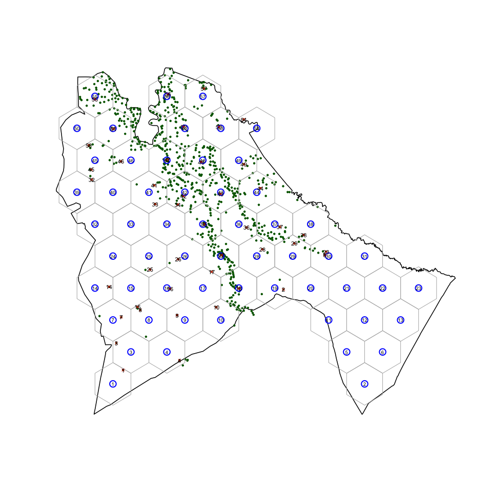

<!-- README.md is generated from README.Rmd. Please edit that file -->

# spatialsampler

[](https://travis-ci.org/validmeasures/spatialsampler)
[](https://ci.appveyor.com/project/validmeasures/spatialsampler)
[](https://codecov.io/gh/validmeasures/spatialsampler)

## Installation

You can install `spatialsampler` from GitHub with:

``` r
# install.packages("devtools")
devtools::install_github("validmeasures/spatialsampler")
library(spatialsampler)
```

    #> Downloading GitHub repo validmeasures/spatialsampler@master
    #> from URL https://api.github.com/repos/validmeasures/spatialsampler/zipball/master
    #> Installing spatialsampler
    #> '/Library/Frameworks/R.framework/Resources/bin/R' --no-site-file  \
    #>   --no-environ --no-save --no-restore --quiet CMD INSTALL  \
    #>   '/private/var/folders/fk/s0yv8hhn2cs_nfsmzhm4dmhc0000gn/T/Rtmpnb2asD/devtools7c28418ffae9/validmeasures-spatialsampler-4374b04'  \
    #>   --library='/Library/Frameworks/R.framework/Versions/3.5/Resources/library'  \
    #>   --install-tests
    #> 


